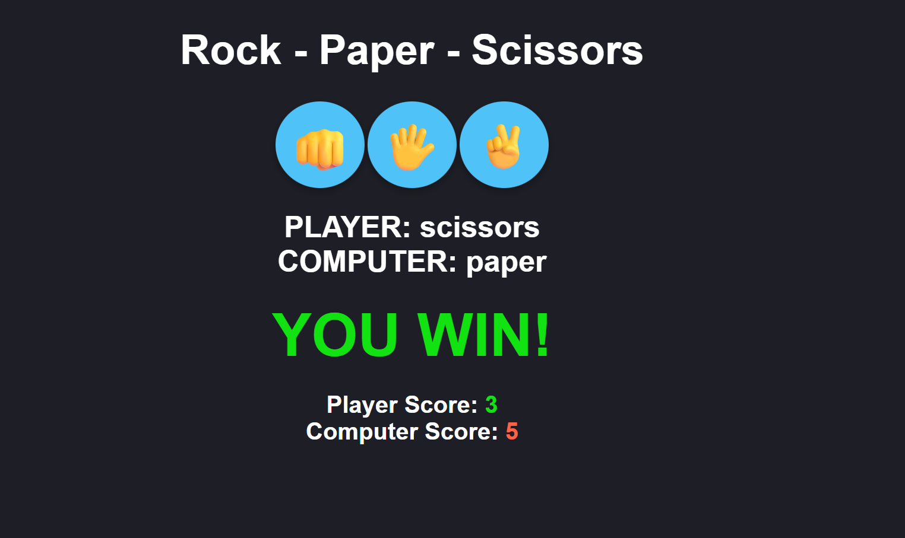

# 🪨 Rock Paper Scissors Game

A responsive and interactive Rock-Paper-Scissors game built using HTML, CSS, and JavaScript.

## 🎮 Features
- Choose Rock, Paper, or Scissors
- Computer randomly selects its choice
- Shows real-time result: win, lose, or draw
- Score is tracked for both player and computer
- Fully styled with emoji-based buttons and responsive layout

## 🔧 Tech Stack
- HTML5
- CSS3
- JavaScript (Vanilla)

## 🌐 Live Demo
👉 [Click here to play](https://yashsarode31.github.io/rock-paper-scissors/)

## 📷 Preview

## ✨ What I Learned
- Event handling with JavaScript
- Random logic and condition checking
- DOM manipulation and styling
- Responsive UI with CSS

---

Made with 💻 by [Yash Sarode](https://github.com/yashsarode31)
